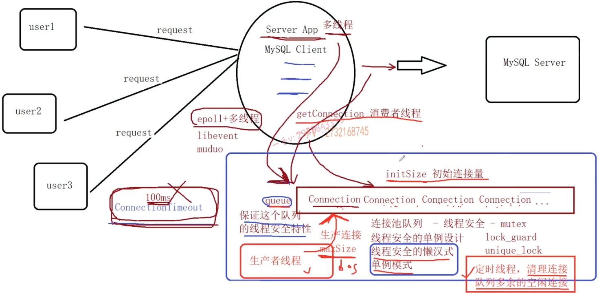

# 数据库连接池

---

为了提高mysql数据库的访问瓶颈，除了在服务器端增加缓存服务器、缓存常用数据之外（如redis、memory cache等），

还可以增加数据库连接池，来提高mysqlserver的访问效率，

在高并发的情况下，基于C/S架构的mysql数据库会产生大量的tcp三次握手、mysqlserver连接认证、mysqlserver关闭连接回收资源、tcp四次挥手，这样的耗费的性能时间是非常惊人的，增加数据库连接池就是为了减少这一部分性能的损耗，

比较流行的连接池包括阿里的druid、c3p0以及apache dbcp连接池，对于短时间内大量的数据库增删改查操作性能的提升是非常明显的，但是都是使用java实现，本项目采用C++实现数据库连接池，提高mysqlserver的访问效率，

### 1.技术点

主要技术点：

1. mysql数据库编程、单例模式、queue队列容器、
2. C++11多线程编程、线程互斥、线程同步、生产者消费者线程模型
3. 基于CAS的原子整型、unique_lock（并没有使用操作系统方面的api，基于C++11语言级别具有一定的跨平台特性）、
4. 智能指针share_ptr、lambda表达式、

### 2.连接池功能点

数据库连接池主要参数：

连接池一般包含了数据库连接所用的ip地址、port端口号、用户名称、密码以及其他参数，

例如初始连接量initSize、最大连接量maxSize、最大空闲时间maxIdleTime、连接超时时间connectionTimeout，主要实现连接池都支持的通用的基础功能，

- **初始连接量initSize**：连接池会事先和mysql创建initSize个数的connection连接，当应用发起mysql访问时，不再创建和mysqlserver新的连接，而是直接从连接池中获取到一个可用的连接。使用完成后也并不会去释放connection，而是将当前connection归还到数据库连接池中，

- **最大连接量maxSize**：当并发访问mysqlserver的请求增多时，初始连接量已经不够使用了，此时会根据新的请求数量自动创建更多的连接给应用去使用，但是新创建的连接数量的上限是maxize，

    不能无限制的创建连接，因为每一个连接都会占用一个socket资源，一般连接池和服务器程序是部署在一台主机上的，如果连接池占用过多的socket资源，那么服务器就不能接收太多的客户端请求了。

- **最大空闲时间maxIdleTime**：当访问mysql的并发请求多了以后，连接池里面的连接数量会动态增加上限是maxSize，当这些连接用完再次归还到连接池当中，如果在指定的maxIdleTime里面，这些新增加的连接都没有被再次使用过，那么新增加的这些连接资源就要被回收掉，只需要保持初始连接量initSize个连接即可，

- **连接超时时间connectionTimeout**：当mysql并发请求量过大，连接池中的连接数量已经达到maxSize了，而此时没有空闲的连接可以使用，那么此时应用从连接池获取连接无法成功。其通过阻塞的方式获取连接的时间如果超过了connectionTimeout时间，那么获取连接失败，无法访问数据库。

其余连接池的更多功能需要自行扩展实现，本项目不做扩充，

### 3.实现方案

- 连接池代码实现：`ConnectionPool.cpp`和`ConnectionPool.h` 
- 数据库操作代码实现：`Connection.cpp`和`Connection.h` 

连接池主要包含了以下功能点：

1. 连接池只需要一个实例，所以ConnectionPool使用单例模式进行维护设计，需要线程安全的单例模式（懒汉式），
2. 从ConnectionPool中可以获取和mysql的连接connection，
3. 空闲连接connection全部维护在一个线程安全的connection队列中，使用线程互斥锁保证队列的线程安全（lock_guard、unique_lock自动加/解锁），
    - func1：队列中空闲连接时间超过maxIdleTime的就要被释放掉，只保留初始的initSize个连接数量即可（需要放在独立的线程中去实现），
    - func2：如果connection队列为空，还需要再获取连接，此时需要动态创建连接，上限数量为maxSize（生产者线程）
    - func3：如果connection队列为空，而此时连接的数量已经达到上限maxSize，那么等待connectionTimeout时间如果还获取不到空闲连接，那么失败（使用带有超时时间的mutex互斥锁来实现连接超时时间）。
4. 用户获取的连接使用share_ptr智能指针来进行管理，用lambda表达式定制连接释放功能（不是将连接真正释放，而是将连接归还到连接池中），
5. 连接的生产和连接的消费采用生产者-消费者线程模型来设计，使用线程间的同步通信机制：条件变量和互斥锁，

